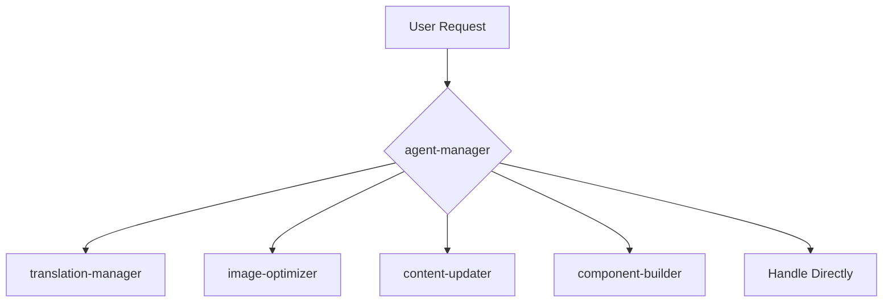

# Claude CLI Agents System

This directory contains specialized agents for the Young Personal Site Next.js project. Each agent handles specific development tasks while following the standards defined in `/CLAUDE.md`.

## Quick Reference

| Agent | Purpose | Use When |
|-------|---------|----------|
| `agent-manager` | Task orchestration & routing | Complex multi-step tasks, coordinating multiple agents |
| `translation-manager` | Bilingual content management | Adding/updating translations in zh-TW and en |
| `image-optimizer` | Image compression & optimization | Compressing images, managing public/images/ directory |
| `content-updater` | Portfolio content management | Adding projects, speaking events, updating page content |
| `component-builder` | React component development | Creating components, implementing Tailwind styling |

## How to Use Agents

### Using Claude CLI
```bash
# Let agent-manager route automatically
claude "Add new project Duotopia with images and translations"

# Invoke specific agent
claude --agent translation-manager "Add translation keys for new feature"

# Multiple agents will be coordinated automatically for complex tasks
```

### Agent Workflow



## Agent Descriptions

### 1. agent-manager.md
**Primary orchestrator** that analyzes tasks and routes to specialized agents.

**Responsibilities:**
- Analyze task complexity and scope
- Route to appropriate specialized agent(s)
- Coordinate multi-agent workflows
- Enforce CLAUDE.md standards
- Handle simple tasks directly

**Auto-invokes when:**
- Task affects 3+ files
- Multi-step workflow required
- System-wide changes needed
- Multiple domains involved (content + images + translations)

**Example tasks:**
- "Add complete project with translations and optimized images"
- "Refactor project structure across multiple components"
- "Bulk update 5 projects with new content"

---

### 2. translation-manager.md
**Bilingual content specialist** for managing translation files.

**Responsibilities:**
- Manage `messages/zh-TW.json` and `messages/en.json`
- Add new translation keys
- Update existing translations
- Ensure synchronization between languages
- Validate JSON syntax and structure

**Use for:**
- Adding translation keys for new features
- Updating existing translations
- Bulk translation operations
- Fixing translation inconsistencies

**Example tasks:**
- "Add translations for new 'testimonials' section"
- "Update all 'About' page translations"
- "Sync translation keys between zh-TW and en files"

**Quality Standards:**
- Traditional Chinese (zh-TW) only
- Professional, natural language
- Consistent key naming (camelCase)
- Same structure in both files
- Valid JSON syntax

---

### 3. image-optimizer.md
**Image optimization specialist** for managing project images.

**Responsibilities:**
- Compress images (target < 500KB)
- Optimize for web delivery
- Manage `public/images/` directory
- Ensure Next.js Image component proper usage
- Batch image processing

**Use for:**
- Compressing new images before adding
- Optimizing existing large images
- Converting image formats
- Batch optimization operations

**Example tasks:**
- "Compress duotopia-banner.jpg to under 500KB"
- "Optimize all images in public/images/"
- "Convert PNG photos to JPEG format"

**Tools used:**
- sips (macOS built-in)
- ImageMagick (optional)
- pngquant (for PNG compression)

**Quality Standards:**
- Target: < 500KB per image
- Max width: 1920px for banners
- JPEG quality: 75-85%
- Maintain visual quality
- Use appropriate formats (JPEG for photos, PNG for graphics)

---

### 4. content-updater.md
**Content management specialist** for portfolio and site content.

**Responsibilities:**
- Add/update projects
- Add/update speaking events
- Modify About page content
- Manage portfolio structure
- Ensure content quality and consistency

**Use for:**
- Adding new projects to portfolio
- Adding speaking events
- Updating page content
- Bulk content operations

**Example tasks:**
- "Add 3 new projects to portfolio"
- "Add speaking event for AI conference"
- "Update About page introduction"

**Works with:**
- `translation-manager`: For translation keys
- `image-optimizer`: For project images
- `component-builder`: For new component needs

**Quality Standards:**
- Professional content quality
- No placeholder text
- Quantifiable impact metrics
- Unique IDs and slugs
- TypeScript type safety

---

### 5. component-builder.md
**React component specialist** for Next.js/React development.

**Responsibilities:**
- Create new React components
- Refactor existing components
- Implement Tailwind CSS styling
- Build responsive designs
- Ensure TypeScript type safety
- Integrate Framer Motion animations

**Use for:**
- Creating new UI components
- Implementing complex layouts
- Adding responsive designs
- Component refactoring

**Example tasks:**
- "Create a new ProjectCard component"
- "Build responsive navigation menu"
- "Add animated hero section with Framer Motion"

**Best Practices:**
- Default to Server Components
- Use "use client" only when necessary
- TypeScript interfaces for all props
- Mobile-first responsive design
- Accessibility attributes (ARIA, semantic HTML)
- Follow project Tailwind conventions

**Quality Standards:**
- TypeScript strict mode
- Tailwind CSS (no inline styles)
- Responsive design (mobile, tablet, desktop)
- Accessibility compliant
- Professional code quality

---

## Agent Coordination Examples

### Example 1: Add Complete New Project
```yaml
Task: "Add Duotopia project with banner image and translations"

agent-manager coordinates:
  1. image-optimizer:
     - Compress duotopia-banner.jpg
     - Output: /images/duotopia-banner.jpg (420KB)

  2. translation-manager:
     - Add projects.duotopia.* keys
     - Add to both zh-TW.json and en.json

  3. content-updater:
     - Add project to projects array
     - Reference image and translations
     - Verify integration

Result: Complete project added, ready for deployment
```

### Example 2: Create New Feature Section
```yaml
Task: "Create testimonials section with translations and styling"

agent-manager coordinates:
  1. translation-manager:
     - Add testimonials.* translation keys

  2. component-builder:
     - Create TestimonialCard component
     - Create TestimonialsSection component
     - Implement Tailwind styling
     - Add responsive design

  3. content-updater:
     - Add testimonials data to page

Result: New section ready with translations and styling
```

### Example 3: Bulk Content Update
```yaml
Task: "Add 5 new projects with images and translations"

agent-manager coordinates:
  1. image-optimizer (parallel):
     - Compress all 5 banner images
     - Verify all < 500KB

  2. translation-manager (parallel):
     - Add all translation keys for 5 projects

  3. content-updater (after above):
     - Add all 5 projects to portfolio
     - Reference images and translations
     - Verify no duplicates

Result: 5 projects added efficiently
```

## Configuration Standards

All agents follow these standards from `/CLAUDE.md`:

### Tech Stack
- Next.js 15 with App Router
- React 19 (Server Components default)
- TypeScript (strict mode)
- Tailwind CSS
- next-intl (zh-TW/en)
- Framer Motion

### Non-Negotiable Rules
1. ✅ Maintain bilingual content (zh-TW + en)
2. ✅ Optimize images (< 500KB target)
3. ✅ Test responsive design
4. ❌ No broken code commits
5. ❌ No sensitive information exposure
6. ✅ Consistent styling (Tailwind)

### Quality Standards
- TypeScript types properly defined
- No console errors
- Professional content
- Fast page loads
- Good accessibility

## File Locations

```
young-personal-site/
├── .claude/
│   └── agents/
│       ├── README.md                    (this file)
│       ├── agent-manager.md             (orchestrator)
│       ├── translation-manager.md       (i18n)
│       ├── image-optimizer.md           (images)
│       ├── content-updater.md           (content)
│       └── component-builder.md         (components)
├── CLAUDE.md                            (project standards)
├── app/
│   ├── [locale]/                        (pages)
│   └── components/                      (shared components)
├── messages/
│   ├── zh-TW.json                       (Chinese translations)
│   └── en.json                          (English translations)
└── public/
    └── images/                          (optimized images)
```

## Agent Communication Format

### Task Delegation
```markdown
🎯 Task: [Clear description]
📊 Complexity: [LOW/MEDIUM/HIGH]
🤖 Agent: [agent-name]
📋 Subtasks:
  1. [Specific action]
  2. [Specific action]

[Invoking {agent-name} agent...]
```

### Success Report
```markdown
✅ [Task] Complete

📝 Changes Made:
  - [File path]: [What changed]

🔍 Verification:
  ✓ [Check 1]
  ✓ [Check 2]

📍 Modified Files:
  - /absolute/path/to/file

⚡ Next Steps:
  - [Suggested action if any]
```

## Development Tips

### When to Use Which Agent

**translation-manager:**
- Single domain: just translations
- No images or complex components needed

**image-optimizer:**
- Single domain: just images
- No content or translation changes

**content-updater:**
- Content updates with existing translations/images
- Portfolio management

**component-builder:**
- New UI components needed
- Complex layout implementation

**agent-manager:**
- Multi-domain tasks
- Complex workflows
- Coordination needed

### Best Practices

1. **Let agent-manager route**: For complex tasks, describe what you need and let agent-manager handle routing

2. **Invoke specific agents**: For simple, single-domain tasks, use specific agents directly

3. **Sequential dependencies**: Some tasks must be sequential (images before content, translations before components)

4. **Parallel when possible**: Independent tasks can run in parallel (multiple image optimizations, multiple translation additions)

## Troubleshooting

### Agent Not Working?
- Verify agent file exists in `.claude/agents/`
- Check YAML frontmatter is valid
- Ensure tools list matches available tools

### Task Not Routing Correctly?
- Be specific in task description
- Mention if it's complex or simple
- Specify domain (content, images, translations, components)

### Multi-Agent Coordination Issues?
- Check if prerequisites completed (translations before content, images before references)
- Verify each step independently
- Review agent-manager logs for routing decisions

## Version History

- **v1.0.0** (2025-12-14): Initial agent system
  - agent-manager: Task orchestration
  - translation-manager: Bilingual content
  - image-optimizer: Image compression
  - content-updater: Portfolio content
  - component-builder: React components

## Contributing

When creating new agents:

1. Follow YAML frontmatter format
2. Define clear responsibilities
3. List available tools
4. Provide examples
5. Document quality standards
6. Integrate with existing agents
7. Update this README

---

**Project**: Young Personal Site
**Framework**: Next.js 15 + React 19 + TypeScript
**Last Updated**: 2025-12-14
